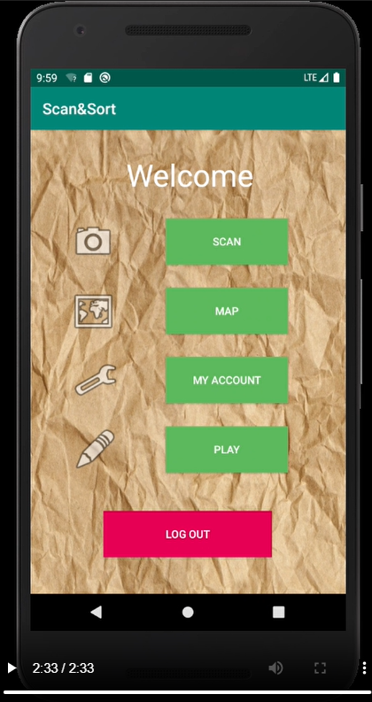

# ScancSort
This student project aims to help users locate the nearest trash can for disposing of their waste responsibly. 
The project is written in Java on Android Studio

It’s an eco-friendly mobile app designed to promote sustainability and responsability toward the environment

The app also features a small quiz to engage users about facts they don't know related to waste management

All data si stored in Firebase

# Demo
You can view the demo of the mobile application in `Demo-Nexus_5X_API_29_x86_5554.mp4`

